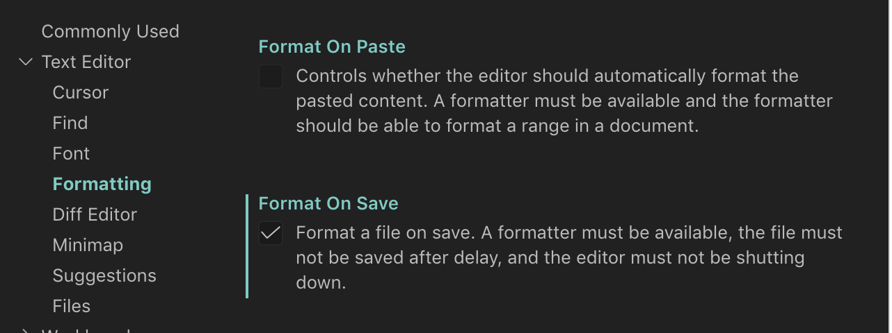
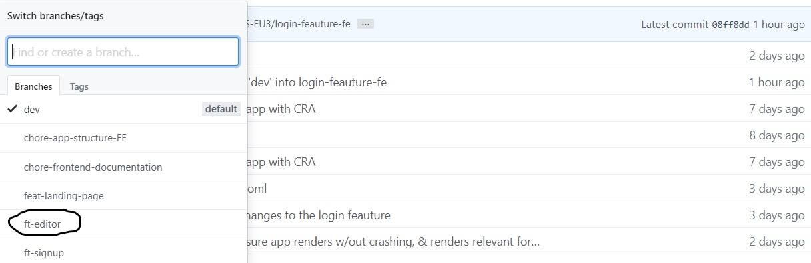
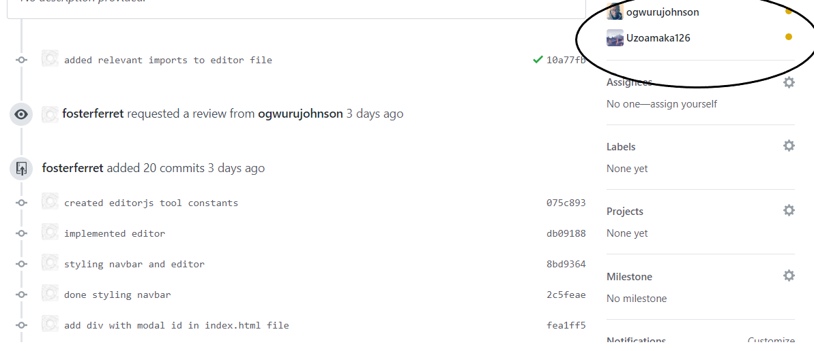
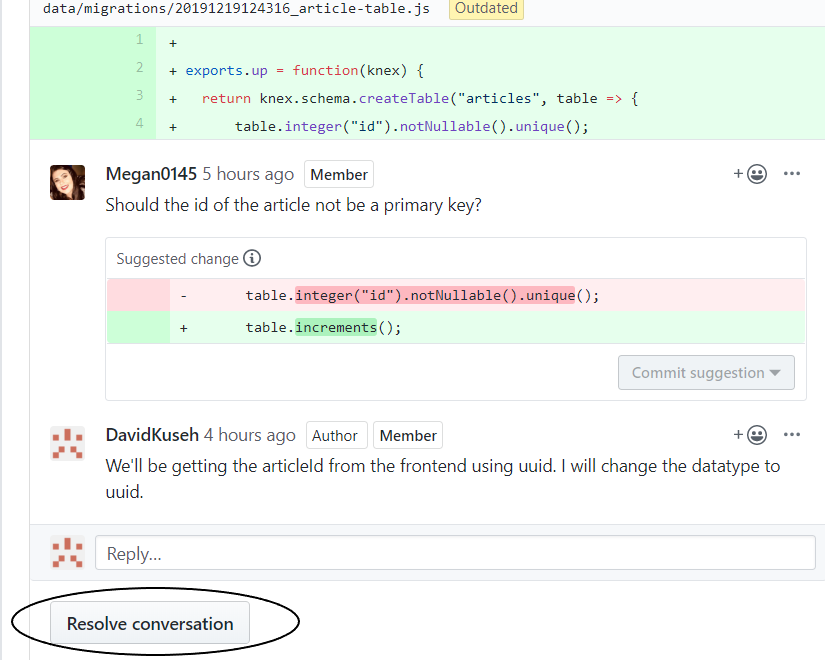

# [Insight Frontend](#Insight-Frontend)

You can find the deployed project at https://getinsightly.com

## [Team](#team)

 [Uzoamaka Anyanwu](https://github.com/Uzoamaka126) | [Megan Ennis](https://github.com/Megan0145) | [Damilola Olawumi](https://github.com/Damilolawumi) | [Johnson Ogwuru](https://github.com/ogwurujohnson) | [Francis Bulus](https://github.com/fosterferret) | [David Kuseh](https://github.com/DavidKuseh)<br>
| --- | --- | --- | --- | --- | --- |
[](https://github.com/Uzoamaka126) | 
[](https://github.com/Megan0145) | 
[](https://github.com/Damilolawumi) |
[](https://github.com/ogwurujohnson) |
[](https://github.com/fosterferret) |
[](https://github.com/DavidKuseh)
[](https://github.com/Uzoamaka126) |
[](https://github.com/Megan0145) |
[](https://github.com/Damilolawumi) |
[](https://github.com/ogwurujohnson) |
[](https://github.com/fosterferret) |
[](https://github.com/DavidKuseh)


## [Project Overview](#Project-Overview)

[Trello Board](https://trello.com/b/HsuE5rL4/labs)<br>
[Product Canvas](https://www.notion.so/96b542fe19f44826a02541b668b540f3?v=1804c577db3c4627a1171466ac7a3cac) <br>
[UX Design files](https://www.figma.com/file/Y4hxd9F1DLn2FkiExRYudV/avocadosandbox)

A writing publishing platform (cms) that allows readers to emoji react to text blocks and text highlights

### [Key Features](#Key-Features)

- users(writers) can create an article in the web app
- users(readers) can view existing articles in the web app
- users(readers) can 'like' an article or react to specific sections of an article using emojis in the web app
- users(writers) can gauge their readers' interests using analytics integrated within the web app

## [Tech Stack](#Tech-Stack)

[Front end built using:](#Front-end-built-using)

- *React/Redux*
- *Styled Components* 
- *EditorJS* 

[Front end deployed to `Netlify`](#Front-end-deployed-to-Netlify) 

# [APIs](#APIs)

- We use [EditorJS](https://editorjs.io/) as our integrated Rich Text Editor

# [Environment Variables](#Environment-variables)

For the app to function correctly, the user must set up their own environment variables. There should be a .env file containing the following:

```
DATABASE_URL = postgres url from elephantsql
```

## [Getting Started](#Getting-started)

These instructions will get you a copy of the project up and running on your local machine for development and testing purposes. See deployment for notes on how to deploy the project on a live system.

### [Prerequisites](#Prerequisites)

For development, you will only need Node.js installed on your environment.

```
$ node --version
v10.16.1

$ npm --version
6.9.0
```

### [Installing](#Installing)

```
$ https://github.com/LABS-EU3/react_blog_frontend
$ cd react-blog
$ npm install
```

### [Starting Development Server](#Starting-development-server)

 ```
 $ npm start
 ```

Runs the app in the development mode.<br />
Open [http://localhost:3000](http://localhost:3000) to view it in the browser. The page will reload if you make edits.<br />

### [Running the tests](#Running-the-tests)

```
$ npm test
```

Launches the test runner in the interactive watch mode.<br />

### [Deployment/Build For Production](#Deployment/Build-For-Production)

```
$ npm run build
```

Builds the app for production to the `build` folder.<br />
It correctly bundles React in production mode and optimizes the build for the best performance.

### [Linting fix](#Linting-fix)

```
$ npm lint:fix
```

Fixes linting automatically

### [Coverage reporting](#Coverage-reporting)

```
$ npm coverage
```

Reports coverage with disabled test-watching

### [Eject hidden modules](#Eject-hidden-modules)

```
$ npm eject
```

Ejects hidden modules into `package.json`

## [Structure and Naming](#Structure-and-naming)

```
    ─src
    │   App.js
    │   global-styles.js
    │   index.css
    │   index.js
    │   setupTests.js
    │   
    ├───assets
    │   └───images
    │           appstr.png
    │           demo.GIF
    │           insight-logo.png
    │           logo.png
    │           lp-pic.png
    │           ps.png
    │       
    ├───pages
    │       Home.js
    │       LandingPage.js
    │       
    ├───redux-store
    │   ├───actions
    │   │       index.js
    │   │       
    │   └───reducers
    │           posts-reducer-editing.js
    │           posts-reducer-reading.js
    │           user-reducer.js
    │           
    ├───utilities
    │   └───axios
    │           index.js
    │           
    └───__tests__
            dummy-test.test.js
            

```

### [Setup formatting on Editor]

On VsCode:

- Go to `Settings` > `Text Editor` > `Formatting`
- Check `Format` on `Save`

Example:



## [Workflow](#Workflow)

- Create a new `feature-branch` from `dev` branch that describes your work.

```
git checkout -b ft-editor
```

Example: 

- **Adding a New Feature**

   - Create Component

   ```
   function Register({ register, registering }){
        <p>
          Get started with Insight for free by creating an account with your
          email address
        </p>
   }

   export default connect(state => state, actionCreators)(Register);
   ```

   - Define Route

   ```
   import Register from './pages/Register';

   ...
  <Route exact path='/register' component={Register}/>
   ```

   - Create Action 

   ```
    export const REGISTER_REQUEST ='REGISTER_REQUEST';
    export const REGISTER_SUCCESS = 'REGISTER_SUCCESS';
    export const REGISTER_FAILURE = 'REGISTER_FAILURE';

    export const register = user => dispatch => {
        dispatch({ type: types.REGISTER_REQUEST });
    axios
        .post("http://localhost:3300/api/auth/register", user)
            .then(res => {
                dispatch({ type: types.REGISTER_SUCCESS });
        })
            .catch(err => {
                console.log(err);
            alert("Please enter valid credentials");
            dispatch({ type: types.REGISTER_FAILURE });
        });
    };
   ```

   - Create Reducer

   ```
    export const registerReducer = (state = initialRegisterState, action) => {
      switch (action.type) {
    case types.REGISTER_REQUEST:
      return { loading: true };
    case types.REGISTER_SUCCESS:
      return { loading: false, success: true };
    case types.REGISTER_FAILURE:
      return { loading: false, success: false };
    default:
      return state;
        }   
    };
    ```

    - Add Reducer to root reducer

    ```
    import { loginReducer } from "./redux-store/reducers/user-reducer";

    const bigReducer = combineReducers({
        registering: registerReducer
    });
    ```

    - Create Test Suite for Component 

    ```
    import React from "react";
    import { render, cleanup } from "@testing-library/react";
    import ReactDOM from "react-dom";
    import Register from "../pages/Register";
    import { createStore } from "redux";    
    import { BrowserRouter } from "react-router-dom";
    import { Provider } from "react-redux";
    import { registerReducer } from "../redux-store/reducers/user-reducer";

    const renderWithRedux = (
    ui,
  { initialState, store = createStore(registerReducer, initialState) } = {}
    ) => {
     return {
    ...render(
      <Provider store={store}>
        <BrowserRouter>{ui}</BrowserRouter>
      </Provider>
    ),
    store
  };
    };

    afterEach(cleanup);

    describe("Register component", () => {
    test("Component mounts without crashing", () => {
    const { getByText } = renderWithRedux(<Register />);
    const heading = getByText(/Try Insight for Free/i);
    expect(heading).toBeInTheDocument();
  });
        test("Button has relevant text content based on whether request is loading", () => {
    const { getByText } = renderWithRedux(<Register />, {
      initialState: { registering: { loading: true } }
    });
    
    const submitRegisterCredsBtn = document.querySelector('[id="register-submit"]');
    expect(submitRegisterCredsBtn).toHaveTextContent(/Loading../i);
    expect(submitRegisterCredsBtn).not.toHaveTextContent(/Try for Free/i);
        });
    });
    ```
    
     - Create Test Suite for Reducer

     ```
    import { cleanup } from '@testing-library/react';
    import userReducer from '../userReducer';
    import { FETCH_START } from '../../actions/user';

    const initialState = {
        loading: false,
        user: null,
        error: '',
    };

    afterEach(cleanup);
        describe('User Reducer', () => {
            it('Should return initial State', () => {
                expect(userReducer(undefined, {})).toEqual(initialState);
    });

            it('Should Toggle Loading state', () => {
                expect(userReducer(initialState, { type: FETCH_START })).toEqual({
            ...initialState,
            loading: true,
            });
        });
    });
     ```

     - Create Test Suite for Action

     ```
    import configureMockStore from 'redux-mock-store';
    import thunk from 'redux-thunk';
    import nock from 'nock';
    import { setUser } from '../user';

    const mockStore = configureMockStore([thunk]);

    describe('Home Action Creator', () => {
        let store;
        beforeEach(() => {
        store = mockStore({});
    });
    afterEach(() => {
        nock.cleanAll();
    });

    it('Should return FETCH_SUCCESS Action with payload', () => {
        nock('https://home.com/api')
        .post('/user')
        .reply(200, {
            user: 'Sample User',
        });
        const expectedActions = [
        {
            type: 'SET_USER_START',
        },
        {
            type: 'SET_USER_ERROR',
            payload: 'Sample User',
        },
        ];
        store = mockStore({});
            return store.dispatch(setUser()).then(() => {
                expect(store.getActions()).toEqual(expectedActions);
            });
        });
    });
     ```

- **Create Pull Request**

    - The PR should consisely explain the change or addition. Example:
    

    - The PR description should clearly state what the PR is about in detail

- **Request a Review** from at least one team member. Example:
    

- Resolve Requested Changes.
 Example:
    

- **All CI status checks should be green** 

- **Review approval should have been submitted before merging**

## [Documentation](#Documentation)

See [Backend Documentation](#Backend-documentation) for details on the backend of our project 

## [License](#License)

This project is licensed under the MIT License - see the [LICENSE](https://github.com/LABS-EU3/react_blog_frontend/blob/dev/LICENSE) file for details

## [Attribution](#Attribution)

These contribution guidelines have been adapted from [this good-Contributing.md-template](https://gist.github.com/PurpleBooth/b24679402957c63ec426).
